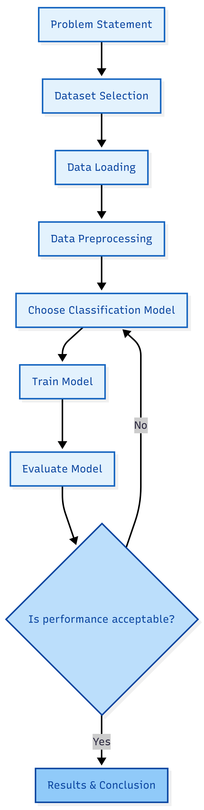

# ARTI 308 – Machine Learning Lab 2  
## Diabetes Prediction Project

## Dataset Summary

**Dataset Name:** Pima Indians Diabetes Dataset  
**Source:** Kaggle  
**Data Type:** Tabular Data (CSV format)  
**Machine Learning Task:** Supervised Learning – Classification  

This dataset contains medical information about patients, including features such as glucose level, blood pressure, BMI, insulin level, age, and other health-related measurements.  

The dataset is structured in rows and columns and is suitable for machine learning analysis.

The target variable is **Outcome**, where:
- 0 = No Diabetes  
- 1 = Diabetes  

## Problem Definition

This project addresses a **binary classification problem**.

The objective is to determine whether a patient has diabetes based on their medical measurements. Since the target variable (**Outcome**) has two possible categories (0 or 1), the problem falls under supervised classification.

The model is expected to learn patterns and relationships between the input features (e.g., glucose level, BMI, age, insulin) and the target variable. After training, the model should be able to predict whether a new patient is likely to have diabetes.

## Target Variable

- **Name:** Outcome  
- **Type:** Categorical (Binary)  
- **Values:** 0 (No Diabetes), 1 (Diabetes)

## Expected Learning Outcome

The model will learn how different medical factors contribute to the likelihood of diabetes and use this knowledge to make predictions on unseen data.

## Methodology Diagram

The methodology diagram was designed using an online diagram-generation tool (Mermaid Live Editor) to visually represent the machine learning workflow.
Artificial intelligence assistance was used to help structure and format the workflow diagram clearly and professionally.

